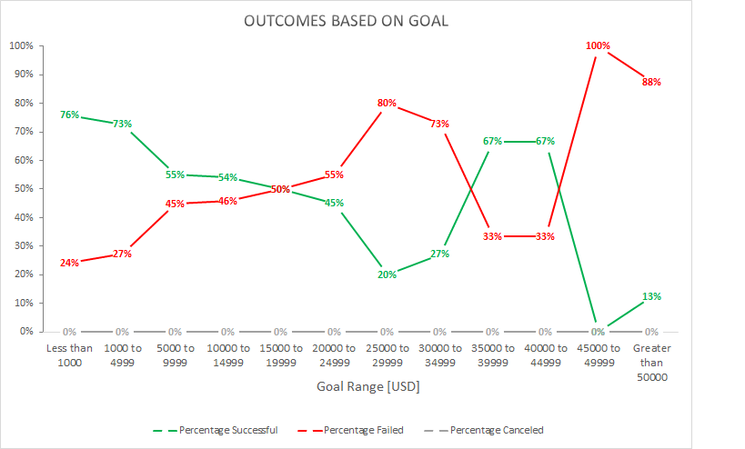
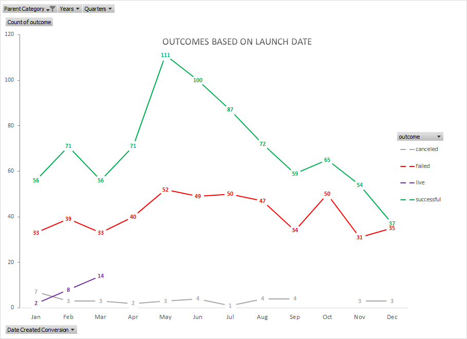

# Week1Challenge
This is the Week #1 Challenge for the Data Analytics &amp; Visualization Bootcamp 

## Conclusions:
As shown in the chart titled “Outcomes Based on Goals” the rate of success is inversely proportional to the amount of the goal.  There is a spike in successful campaigns between $35,000 and $45,000.  However, there are a small number of campaigns in this range (9 total), which could explain this spike.

Looking at the success rate based on the month of the launch date, we see that the optimal time to launch a campaign is in late spring to early summer (May-June).  Fall and Winter (especially December) seem to be the worst time to launch a campaign.  

## Limitations:  
In addition to Kickstarter there are other alternative crowdfunding resources available.  For the purpose of this analysis the data was limited to Kickstarter to meet the objectives within the allotted time and budget.  Furthermore, it appears this data is a few years old as the most recent end date in back in 2017.  
## Recommended Next Actions:
To expand this analysis, we could study the relationship between the length of the Kickstarter campaign and the rate of success.  An Excel Pivot Chart would work well for this study due to the fact that it could easily be manipulated to present the data based on various filters and variables.  We would first need to add columns to the main data table to calculate the number of days that the campaign was open by subtracting the Date Created (converted from Unix Time Stamp raw data) from the Date Ended. 
